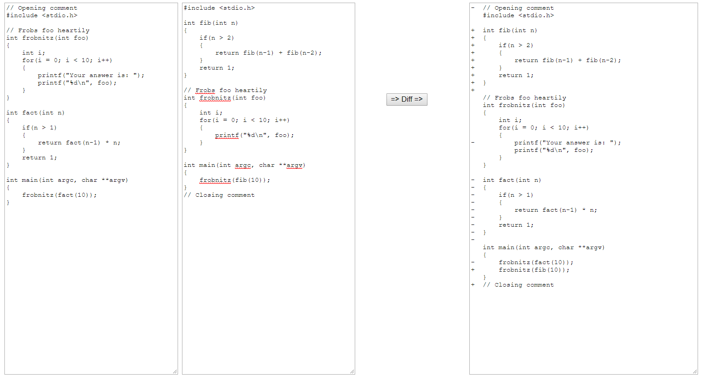

# PatienceDiff  &  PatienceDiffPlus
A concise javascript implementation of the **Patience Diff** algorithm

Plus, an implementation of a new algorithm dubbed **Patience Diff Plus**, which in addition to the usual Patience Diff, identifies lines that moved.

# Interface
### PatienceDiff(aLines, bLines)  &  PatienceDiffPlus(aLines, bLines)

<b>result = patienceDiff(aLines, bLines)</b> - or - <b>result = patienceDiffPlus(aLines, bLines)</b>

where: 
* aLines[] = array of strings representing the original lines of text.
* bLines[] = array of strings representing the new lines of text.
    
* result[] = object containing three properties.
  * lines = array of objects, with properties of:
    * line = line of text from either aLines or bLines.
    * aIndex = index of original line in aLines, or -1 if line is added from bLines.
    * bIndex = index of new line in bLines, or -1 if line is deleted from aLines.
    * moved = true if the line was moved from elsewhere in aLines[] or bLines[]. This only applies to PatienceDiffPlus.
  * lineCountDeleted = the number of lines from aLines[] as having been deleted.
  * lineCountInserted = the number of lines from bLines[] as having been inserted.
  * lineCountMoved = the number of lines, outside the Longest Common Subsequence, that were likely moved.

# Example
Simply download the PatienceDiff.js file which contains the complete algorithm, and PatienceDiff.html which exemplifies how to use the algorithm.  Then open PatienceDiff.html in a browser, and press the "=> Diff =>" button to calculate the difference between the two blocks of text.

# Explanation of the Patience Diff Plus Algorithm
The PatienceDiffPlus algorithm is a new algorithm that extends the PatienceDiff algorithm, to include the *likely* lines that moved.  The algorithm is elegantly straightforward.  PatienceDiffPlus takes the original lines deleted from aLines[] along with the lines inserted into bLines[], and runs these residual subset of lines through the PatienceDiff algorithm.  If any lines match in this subset, then they are *assumed* to have moved rather than being independent deletions and insertions.  The results of the initial PatienceDiff algorithm are then adjusted to record the likely moves.  This is repeated, with any remaining deletions and insertions again run through the PatienceDiff algorithm, until no more matches are found.

Bear in mind that the PatienceDiff algorithm makes use of the Longest Common Subsequence, and therefore the PatienceDiffPlus algorithm is simply matching the residual deletions and insertions, so there is no guarantee that the matching lines actually represent a move, but there is a strong likelihood that they were indeed moved.

#### *An elegant solution that extends the PatienceDiff algorithm by employing itself!*

# Explanation of the Patience Diff Algorithm
The algorithm is best explained by describing the supporting algorithms.

### findUnique(arr, lo, hi) returns Map
The Patience Diff algorithm requires unique entries between the arrays when applying the Longest Common Subsequence algorithm, and the findUnique function uses javascript's Map method to accumulate the total number of similar lines.  Ie, there's no sense in wasting cycles in finding the unique lines between array A and B until finding the unique lines in A and B individually.  After running through all the lines in the array, the Map will contain the line as the key, and an object as the value, with properties of the count of similar lines, and the index of the last matched line.  Then, the Map is walked to remove all entries except for those with count === 1.  Note that since this Patience Diff algorithm is recursive, that findUnique takes the lo and hi range of the array as input parameters.  The use of range indexes also eliminates the performance hit of creating slices of the A and B arrays. 

In terms of complexity, presumably the javascript Map function is based on a hashing algorithm, and therefore O(1) in execution, and therefore the findUnique function is O(N).  Or more accurately, O(Na) and O(Nb) for each array, but assuming the arrays being compared are generally equal in length, the complexity is O(N).  Additionally, walking the Map to eliminate all but count === 1 is also linear in time, therefore not affecting the complexity.

### uniqueCommon(aArray, aLo, aHi, bArray, bLo, bHi) returns Map
The uniqueCommon function does what it's named, and finds the unique common lines between arrays A and B.  This is accomplished first by calling findUnique individually for arrays A and B, at which point two Maps represent the unique lines in A and the unique lines in B.  Then array A is walked, looking for the corresponding line in array B.  If found, the A Map value is supplemented with the corresponding matching B Map index value, otherwise the A Map entry is deleted as there is no matching unique line in B.  Again, this function takes lo and hi ranges, as the overall function is designed to be recursive.

In terms of complexity, once the A and B Maps are in hand, the uniqueCommon function simply walks the A Map seeking, presumably via hash, the B Map value, and therefore is also O(N) in a worse case situation in which arrays A and B completely match with unique lines.

### longestCommonSubsequence(abMap) returns Array
The longestCommonSubsequence algorithm is best described by the "Alfedenzo" article at https://alfedenzo.livejournal.com/170301.html.  Suffice to say, it walks the result of uniqueCommon to build a jagged array, and then walks this jagged array backwards to find the longest common subsequence.  Since the jagged array is walked backwards, it is reversed and then returned.

In terms of complexity, again this is O(N) worse case, as the three (3) steps are all single pass linear in nature: 1) building the jagged array, 2) walking the jagged array backwards, and 3) reversing the result before returning.

### addSubMatch(aLo, aHi, bLo, bHi) adds values to the "result" array
Here's where it gets fun.  The addSubMatch function is being told that A[Lo-aHi] and B[bLo-bHi] inclusive, represent a range between a pair of matching unique values discovered by the longestCommonSubsequence (LCS).  That being said, there are edge cases at the beginning and end of the LCS, in which there might be lines in either array A or B before the first unique common line is found, and the same goes for lines occurring after the last unique common line found.  And generally speaking, when the range between an LCS pair is passed to addSubMatch, it includes the lo entry up to, but not including the hi entry, because for the next LCS pair, the hi entry becomes the lo on the next iteration of calling addSubMatch.  Again, indexes to the A and B arrays are passed to addSubMatch to avoid the performance hit of creating slices.

By example, let's say for text line arrays A[0..22] and B[0..28], the LCS found the following three (3) unique matches:
- A[5]  === B[7]
- A[12] === B[14]
- A[15] === B[20]

Then, the sequence of calls to addSubMatches will be with the following ranges:
- A[0..4]   /  B[0..6]
- A[5..11]  /  B[7..13]
- A[12..14] /  B[14..19]
- A[15..22] /  B[20..28]

Once addSubMatch begins processing, the first thing it does is match any lines at the beginning and ending of the A and B ranges.  The matches at the beginning are added to the "result" array.  The matches at the end of the range are held, until the disposition of the sandwiched lines are dealt with by determining if this remaining subsequence has any unique lines in common between arrays A and B, in which case a recursive call is made to the core recurseLCS function.  If there are no unique lines in common, then we're at a point where anything in array A can be included in "result" as having been deleted, and anything in array B can be included in "result" as having been inserted.  If having traveled the recursion path, once the recursion unwinds, any intervening results will have been placed on the "result" array, at which time now addSubMatch can place the matches found at the end of the original subsequence on the "result" array, ensuring the proper order of the results.

In terms of complexity, addSubMatch on its own is linear and therefore O(N), but the occasional recursion in essense is recalculating uniqueCommon lines in the smaller subsequence.  It kinda smells like O(N log N) worse case, and in best case (where both arrays A and B virtually match), addSubMatch will be O(N) due to little or no recursion.  A large sample of tests would be required to verify...

### recurseLCS(aLo, aHi, bLo, bHi, uniqueCommonMap) adds to "result" array via addSubMatch
Finally we get to the main routine, which basically starts with the entire A and B array ranges, performing the following logic:
- Get the longest common subsequence (LCS) of unique common lines for the provided range A[aLo..aHi] and B[bLo..bHi].
- If there are no unique common lines, then call addSubMatch with the entire range to add the lines to the "result" array.
- If the LCS did return some unique lines in common for the provided range, then:
  - call addSubMatch with any lines preceding the first LCS entry.
  - Then loop through the LCS entries calling addSubMatch (see explanation in addSubMatch) for the rows between the LCS entries.
  - And finally, call addSubMatch with any lines following the last LCS entry.
  
When complete, the "result" array will contain the ordered list of lines representing the Patience Diff.

#### *Voila! An enjoyable algorithm to code for one who seeks elegant solutions...*

# References
The patience diff algorithm is credited to Bram Cohen of Bittorrent fame. Additionally, the article by "Alfedenzo" at https://alfedenzo.livejournal.com/170301.html was of immense help in understanding the Longest Common Subsequence (LCS) algorithm, and by tradition, is also the source of the data embedded in the associated example HTML document.
